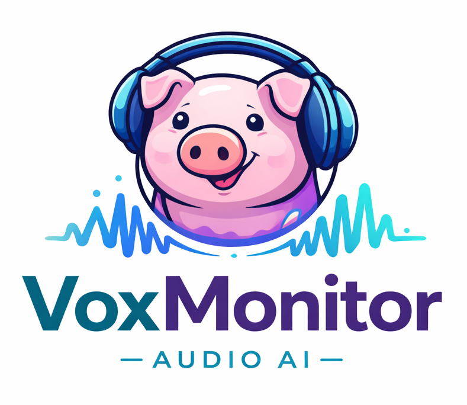

<p align="center">
    
</p>

# VoxMonitor

Multi-task pig vocalization classification and synthesis using DeepSuite and PyTorch Lightning.

## Features

- **Mel-spectrogram extraction**: Librosa-compatible feature extraction for audio signals
- **Multi-task CNN backbone**: Shared audio encoder with task-specific classification heads (age, sex, valence, context)
- **PyTorch Lightning training**: Full training pipeline with checkpointing, early stopping, and model export
- **DeepSuite integration**: Leverages shared deep learning infrastructure (BaseTrainer, callbacks, metrics)
- **uv environment management**: Reproducible Python environment with dependency locking

## Installation

### Using `uv`

```bash
cd VoxMonitor
uv sync
```

### Manual pip

```bash
pip install -e .
pip install -e ".[dev]"  # Include development dependencies
```

## Quick Start

### Training

```bash
# Train using default config
uv run voxmonitor-train

# Train with custom config
uv run voxmonitor-train --config path/to/config.yaml
```

Or run directly:

```bash
uv run python -m voxmonitor.train_pl config/config.yaml
```

### Configuration

Edit `config/config.yaml` to customize training:

```yaml
data:
  root_dir: data/audio
  key_xlsx: data/SoundwelDatasetKey.xlsx
  sample_rate: 16000
  val_fraction: 0.2

labels:
  columns:
    - age
    - sex
    - valence
    - context

train:
  batch_size: 32
  lr: 1e-3
  weight_decay: 1e-5
  max_epochs: 100
  checkpoint_dir: ckpt/voxmonitor
  device: auto  # auto, cuda, mps, cpu

model:
  embed_dim: 128
```

### Python API

```python
from voxmonitor.data import SoundwelDataModule
from voxmonitor.lightning import VoxMonitorLightningModule
import pytorch_lightning as pl

# Initialize data module
dm = SoundwelDataModule(
    root_dir="data/audio",
    key_xlsx="data/SoundwelDatasetKey.xlsx",
    label_columns=["age", "sex", "valence", "context"],
    batch_size=32,
)

# Initialize model
lit = VoxMonitorLightningModule(
    num_classes={"age": 4, "sex": 2, "valence": 3, "context": 5},
    lr=1e-3,
)

# Train
trainer = pl.Trainer(max_epochs=100)
trainer.fit(lit, dm)

# Export
import torch
torch.save(lit.module.state_dict(), "voxmonitor_final.pt")
```

## Architecture

### Data Pipeline

- **SoundwelDataset**: Loads audio from files, extracts Mel-spectrograms, maps labels to class indices
- **SoundwelDataModule**: PyTorch Lightning DataModule with train/val splitting and balanced batching

### Model Architecture

```
Input Audio [B, time_steps]
    ↓
MelSpectrogramExtractor [B, 1, n_mels=64, time_frames]
    ↓
AudioCNN Backbone (residual blocks) [B, embed_dim=128]
    ├→ Classification Head (age) [B, num_classes_age]
    ├→ Classification Head (sex) [B, num_classes_sex]
    ├→ Classification Head (valence) [B, num_classes_valence]
    └→ Classification Head (context) [B, num_classes_context]
```

### Training

- **VoxMonitorLightningModule**: Multi-task learning with equal loss weighting
- **Loss**: Cross-entropy per task, summed and normalized
- **Callbacks**: ModelCheckpoint (top-3), EarlyStopping (patience=10)
- **Optimizer**: Adam with configurable learning rate and weight decay

## DeepSuite Integration

VoxMonitor extends `deepsuite.lightning_base.BaseTrainer` to leverage:

- Unified training interface across all DeepSuite projects
- Automatic logging and checkpoint management
- Modular model export (TorchScript, ONNX, TensorRT)

Future: Register audio classification as a head in `deepsuite.registry.HeadRegistry` for multi-domain livestock inspection pipelines.

### DeepSuite HeadRegistry

VoxMonitor registriert sich als Head in der globalen `HeadRegistry` unter dem Schlüssel `voxmonitor.audio.multitask`. Damit kannst du das Modul überall in DeepSuite-Pipelines referenzieren.

Minimalbeispiel (direkt aus Registry bauen und trainieren):

```python
from deepsuite.registry import HeadRegistry
from voxmonitor import register_voxmonitor_head
from voxmonitor.data import SoundwelDataModule
import pytorch_lightning as pl

# Optional explizit registrieren (import von voxmonitor registriert bereits automatisch)
register_voxmonitor_head()

dm = SoundwelDataModule(
  root_dir="data/audio",
  key_xlsx="data/SoundwelDatasetKey.xlsx",
  label_columns=["age", "sex", "valence", "context"],
)
dm.setup("fit")

factory = HeadRegistry.get("voxmonitor.audio.multitask")
lit = factory(
  num_classes={"age": 4, "sex": 2, "valence": 3, "context": 5},
  lr=1e-3,
  weight_decay=1e-5,
  embed_dim=128,
)

trainer = pl.Trainer(max_epochs=50)
trainer.fit(lit, dm)
```

Beispiel mit DeepSuite-Trainer-Helper:

```python
from deepsuite.lightning_base.trainer import train_heads_with_registry
from voxmonitor.data import SoundwelDataModule

dm = SoundwelDataModule(
  root_dir="data/audio",
  key_xlsx="data/SoundwelDatasetKey.xlsx",
  label_columns=["age", "sex", "valence", "context"],
)

train_heads_with_registry(
  heads=[
    {
      "key": "voxmonitor.audio.multitask",
      "params": {
        "num_classes": {"age": 4, "sex": 2, "valence": 3, "context": 5},
        "lr": 1e-3,
        "weight_decay": 1e-5,
        "embed_dim": 128,
      },
    },
  ],
  data_module=dm,
  trainer_kwargs={"max_epochs": 50},
)
```

## Development

### Code Quality

```bash
# Lint with ruff
uv run ruff check src/

# Format with black
uv run black src/

# Type check with mypy
uv run mypy src/

# Run tests
uv run pytest tests/
```

### Project Structure

```
VoxMonitor/
├── src/voxmonitor/
│   ├── __init__.py          # Package exports
│   ├── model.py             # Audio CNN, Mel-spectrogram extractor
│   ├── data.py              # SoundwelDataset, SoundwelDataModule
│   ├── lightning.py         # VoxMonitorLightningModule
│   ├── train_pl.py          # Training script and CLI entrypoint
│   ├── train_classifier.py  # Legacy (deprecated)
│   └── utils.py             # Utilities
├── config/
│   └── config.yaml          # Training configuration
├── data/
│   └── SoundwelDatasetKey.xlsx  # Dataset metadata
├── ckpt/                    # Checkpoints and exports
├── tests/                   # Unit tests
├── pyproject.toml           # Project metadata (uv, hatchling)
└── README.md               # This file
```

## References

- [PyTorch Audio](https://pytorch.org/audio/stable/index.html)
- [PyTorch Lightning](https://lightning.ai/)
- [DeepSuite](../DeepSuite/)
- Soundwel Pig Vocalization Dataset

## License

Apache 2.0
